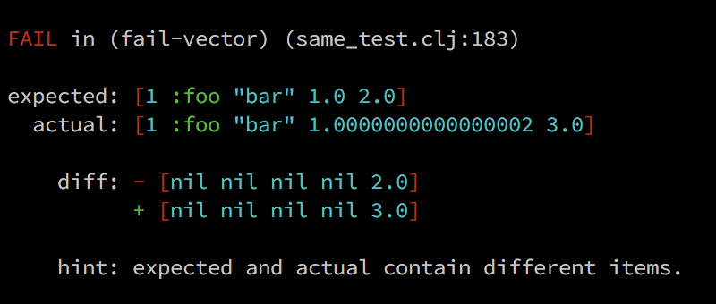

# Test Output

If you use [ultra](https://github.com/venantius/ultra)
or [humane-test-output](https://github.com/pjstadig/humane-test-output)
to prettify your test outputs, you will also get diff outputs for tests using `ish?`
as well as those using `=`, e.g.:

